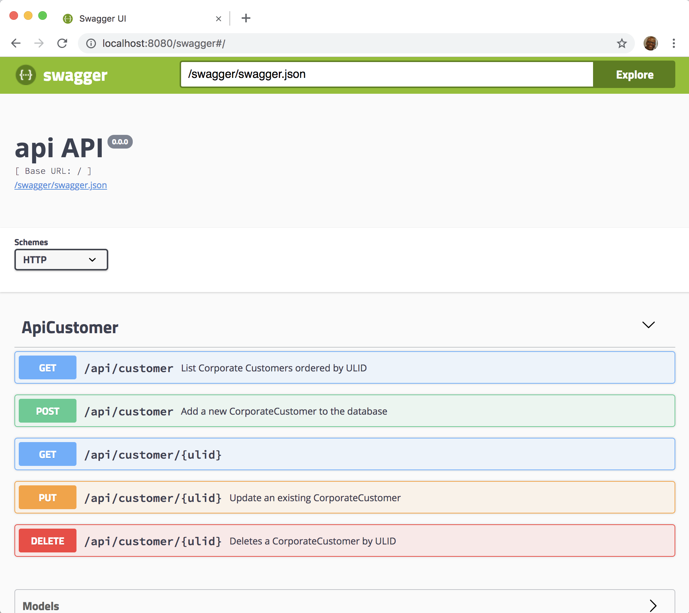

# kotlin-magics

**Lean Principles**   
* **Deliver as fast as possible**  
* **Decide as late as possible**   
  
  
Avoid long cycles of specification and refinements to start to implement.  
Write code that doesn't became obsolete as you learn more about the business.  
  
    
Have all this by programming at the appropriate level of abstraction.  
  
  
Creating your programming languages.  
  

### Implementation

Here you will find **RESTful API | Swagger | Reflection**.  
And **Domain-specific Language**. 
  
  
This project is a POC for a project requiring a translation between two very similar APIs.  
For this purpose we create one API with field names in English and another one having almost the same fields but with names in Portuguese.  


Then a DSL (Domain-specific Language) was designed:. 
1. to make the code to be short, so it's easy to write;
2. to make data translation to be declarative, so it's easy to understand and maintain,. 
3. to make the resulting codification to be very abstract, so it's not affected by details that permanently need clarification.  

### Basics
#### build
./gradlew clean build install -x test

#### Running

> com.github.br11.kondoocthor.customer.api.CustomerApi::main

```
[main] INFO com.github.br11.kondoocthor.customer.api.CustomerApi - [dev@netty]: Server started in 1266ms

  GET    /swagger/swagger.json    [*/*]     [*/*]    (/anonymous)
  GET    /swagger/swagger.yml     [*/*]     [*/*]    (/anonymous)
  GET    /swagger/static/**       [*/*]     [*/*]    (/anonymous)
  GET    /swagger/static/**       [*/*]     [*/*]    (/anonymous)
  GET    /swagger                 [*/*]     [*/*]    (/anonymous)
  GET    /raml/api.raml           [*/*]     [*/*]    (/anonymous)
  GET    /raml/static/**          [*/*]     [*/*]    (/anonymous)
  GET    /raml                    [*/*]     [*/*]    (/anonymous)
  GET    /                        [*/*]     [*/*]    (/anonymous)
  GET    /api/customer            [*/*]     [*/*]    (/anonymous)
  GET    /api/customer/:ulid      [*/*]     [*/*]    (/anonymous)
  POST   /api/customer            [*/*]     [*/*]    (/anonymous)
  PUT    /api/customer/:ulid      [*/*]     [*/*]    (/anonymous)
  DELETE /api/customer/:ulid      [*/*]     [*/*]    (/anonymous)

listening on:
  http://localhost:8080/
```

### More

#### Documenting API with javadoc - Magic with Kooby & ApiTool
Here is our API implemented with Jooby for Kotlin.  
The decision of using Jooby was made mainly because the ApiTool module of Jooby implements a large number of integrations, including one with Swagger that generates the REST API documentation from the Javadoc.

Source code
````kotlin
class CustomerApi : Kooby({

    /** JSON: */
    use(Jackson())

    /** Export API to Swagger and RAML: */
    use(ApiTool()
            .filter { r -> r.pattern().startsWith("/api") }
            .swagger()
            .raml())
            
    path("/api/customer") {
    
        /**
         * Find CorporateCustomer by ULID
         *
         * @param ulid CorporateCustomer ULID.
         * @return Returns `200` with a single CorporateCustomer or `404`
         */
        get("/:ulid") {
            CorporateCustomerService().retrieveApproved(param<String>("ulid"))
        }
    
        /**
         * Add a new CorporateCustomer to the database.
         *
         * @param body CorporateCustomer object that needs to be added to the database.
         * @return Returns a saved CorporateCustomer.
         */
        post {
             CorporateCustomerService().saveApproved(body<CorporateCustomer>())
        }
        
        /* to be continued */
````
   
The API documentation derived from the Javadoc  



#### DLS - Domain-specific Language

The DSL implementation with a **fluid interface** for API Proxing - uhu!!! a lot of reflections behind the scenes:P. 

I know it needs clarification but all I have for now is this brief introduction.  
Basically it takes a message of one type and sends it upstream after translating into another one. Most of the code is property mapping from the type received through our API into the type required by the uptream API of the third party.

````kotlin
class CorporateCustomerService {

    val proxy: Proxy<CorporateCustomer, CorporateCustomer>

    constructor() {

        proxy = Proxy {

            use(GlobaltagcadastroclienteApi())

                    .receive(CorporateCustomer::class)

                    .passTo(GlobaltagcadastroclienteApi::salvarPessoaJuridicaAprovadaUsingPOST)
                    .mapping(

                            CorporateCustomer::cnpj to PessoaJuridicaAprovadaPersist::setCnpj,
                            CorporateCustomer::name to PessoaJuridicaAprovadaPersist::setRazaoSocial,
                            CorporateCustomer::shortName to PessoaJuridicaAprovadaPersist::setNomeFantasia,
                            CorporateCustomer::productUlId to convert(::ulidToId to PessoaJuridicaAprovadaPersist::setIdProduto),
                            CorporateCustomer::email to PessoaJuridicaAprovadaPersist::setEmail,
                            CorporateCustomer::paymentDay to PessoaJuridicaAprovadaPersist::setDiaVencimento,
                            CorporateCustomer::accountNumber to PessoaJuridicaAprovadaPersist::setNumeroContaCorrente,
                            CorporateCustomer::bankBranchId to PessoaJuridicaAprovadaPersist::setNumeroAgencia,
                            CorporateCustomer::bankId to PessoaJuridicaAprovadaPersist::setNumeroBanco,
                            CorporateCustomer::maxAmount to PessoaJuridicaAprovadaPersist::setLimiteMaximo,

                            nestedList(CorporateCustomer::addresses to PessoaJuridicaAprovadaPersist::setEnderecos)
                                    .mapping(Address::street to EnderecoAprovadoPersistValue::setLogradouro,
                                            Address::complement to EnderecoAprovadoPersistValue::setComplemento,
                                            Address::city to EnderecoAprovadoPersistValue::setCidade,
                                            Address::state to EnderecoAprovadoPersistValue::setUf,
                                            Address::zipcode to EnderecoAprovadoPersistValue::setCep,
                                            Address::contry to EnderecoAprovadoPersistValue::setPais),

                            nestedList(CorporateCustomer::partners to PessoaJuridicaAprovadaPersist::setSocios)
                                    .mapping(Partner::name to SocioAprovadoPersistValue::setNome,
                                            Partner::cpf to SocioAprovadoPersistValue::setCpf,
                                            Partner::birthDate to SocioAprovadoPersistValue::setDataNascimento,
                                            Partner::occupation to SocioAprovadoPersistValue::setProfissao,
                                            Partner::email to SocioAprovadoPersistValue::setEmail,

                                            nestedList(Partner::phoneNumbers to SocioAprovadoPersistValue::setTelefones)
                                                    .mapping(PhoneNumber::idType to TelefonePessoaAprovadaPersistValue::setIdTipoTelefone,
                                                            PhoneNumber::areaCode to TelefonePessoaAprovadaPersistValue::setDdd,
                                                            PhoneNumber::number to TelefonePessoaAprovadaPersistValue::setTelefone,
                                                            PhoneNumber::extension to TelefonePessoaAprovadaPersistValue::setRamal)))

                    .getUpstreamResponse()

                    .respond(CorporateCustomer::class)
                    .mapping(

                            PessoaJuridicaAprovadaResponse::getCnpj to CorporateCustomer::cnpj,
                            PessoaJuridicaAprovadaResponse::getId to convert(::idToUlid to CorporateCustomer::ulid),
                            PessoaJuridicaAprovadaResponse::getRazaoSocial to CorporateCustomer::name,
                            PessoaJuridicaAprovadaResponse::getNomeFantasia to CorporateCustomer::shortName,
                            PessoaJuridicaAprovadaResponse::getIdProduto to CorporateCustomer::productUlId,
                            PessoaJuridicaAprovadaResponse::getEmail to CorporateCustomer::email,
                            PessoaJuridicaAprovadaResponse::getDiaVencimento to CorporateCustomer::paymentDay,
                            PessoaJuridicaAprovadaResponse::getNumeroContaCorrente to CorporateCustomer::accountNumber,
                            PessoaJuridicaAprovadaResponse::getNumeroAgencia to CorporateCustomer::bankBranchId,
                            PessoaJuridicaAprovadaResponse::getNumeroBanco to CorporateCustomer::bankId,
                            PessoaJuridicaAprovadaResponse::getLimiteMaximo to CorporateCustomer::maxAmount,

                            nestedList(PessoaJuridicaAprovadaResponse::getEnderecos to CorporateCustomer::addresses)
                                    .mapping(EnderecoAprovadoResponse::getLogradouro to Address::street,
                                            EnderecoAprovadoResponse::getComplemento to Address::complement,
                                            EnderecoAprovadoResponse::getCidade to Address::city,
                                            EnderecoAprovadoResponse::getUf to Address::state,
                                            EnderecoAprovadoResponse::getCep to Address::zipcode),

                            nestedList(PessoaJuridicaAprovadaResponse::getSocios to CorporateCustomer::partners)
                                    .mapping(SocioAprovadoResponse::getNome to Partner::name,
                                            SocioAprovadoResponse::getCpf to Partner::cpf,
                                            SocioAprovadoResponse::getDataNascimento to Partner::birthDate,
                                            SocioAprovadoResponse::getProfissao to Partner::occupation,
                                            SocioAprovadoResponse::getEmail to Partner::email,
ok
                                            nestedList(SocioAprovadoResponse::getTelefones to Partner::phoneNumbers)
                                                    .mapping(TelefonePessoaAprovadaResponse::getIdTipoTelefone to PhoneNumber::idType,
                                                            TelefonePessoaAprovadaResponse::getDdd to PhoneNumber::areaCode,
                                                            TelefonePessoaAprovadaResponse::getTelefone to PhoneNumber::number,
                                                            TelefonePessoaAprovadaResponse::getRamal to PhoneNumber::extension)))

                    .onError()
                    .map(ApiException::class to RuntimeException::class)
        }
    }

    fun saveApproved(request: CorporateCustomer): CorporateCustomer {
        return proxy.process(request)
    }
}
````
  
    
Work in progress ...  
